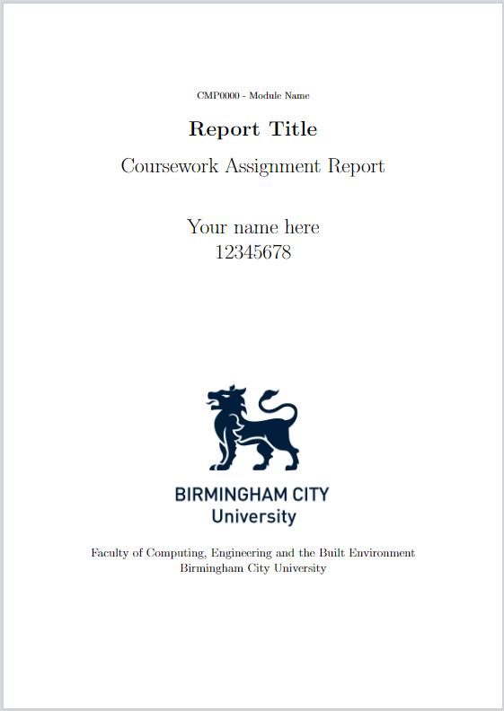

# Thesis/Report starter template for LaTex (Following BCU and Harvard referencing styles)

This is a template I made during my Bachelors at BCU to help me quick start any reports I had to write for coursework. 

I now lend my work so it may aid in getting you started with Tex docs and maybe help you avoid some of the headaches along the way. The gist of it is all the packages used and small tweaks to fit the academic writing style demanded by my university. I highly encourage you to go through all the packages in the Template\_index.tex file and familiarise yourself with them.

<i>Remember: Credit's due where credit's due.</i>
